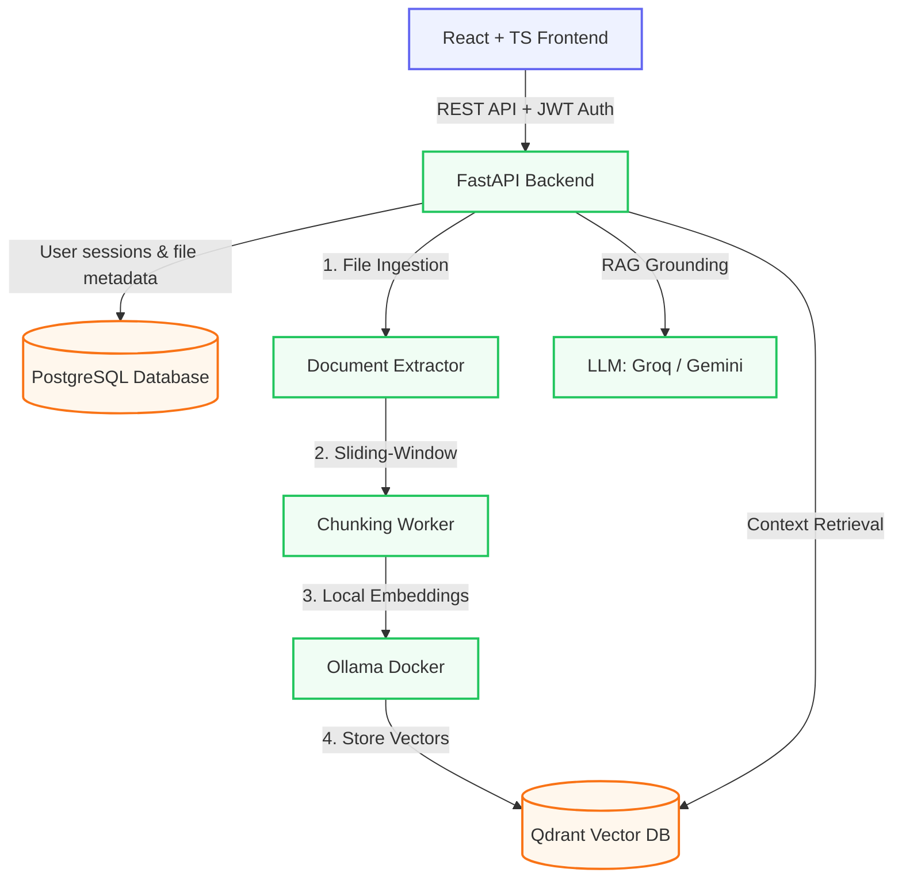

# 🧠 DocuMind AI

DocuMind AI is a self-hosted, privacy-first Document Knowledge Retrieval-Augmented Generation (RAG) Workspace. It allows you to upload local document files (PDFs, Word documents, Plain Text, or Markdown) and converse with them in natural language. Get instant, grounded, and concise answers backed by page-level citation highlights and hover previews—completely offline & secure.

---

## 🏛️ System Architecture



---

## ✨ Features (Version 1.0 MVP)

*   **Granular Ingestion Pipeline Statuses**: Real-time progress updates during document processing (`Extracting text...` $\rightarrow$ `Generating chunks...` $\rightarrow$ `Vectorizing embeddings...` $\rightarrow$ `Completed`).
*   **Local & Free Embedding Engine**: Docker-hosted Ollama runs the `nomic-embed-text` model locally to vectorize document chunks at zero cost, ensuring data privacy.
*   **Interactive Document Previewer**: Click directly on the active document context tag to view the file inside a modal viewer.
    *   **PDFs, Text, & Markdown**: Natively previewed using in-memory secure blob URL iframes.
    *   **Word Documents (.docx)**: Client-side parsed and rendered using `docx-preview` to rebuild document styling, tables, and typography.
*   **Concise Grounded Citations**: Chat responses include clean, deduplicated page pills (e.g. `📄 Ref Page 2`). Hovering over a badge displays the document name, similarity relevance score, and the exact text snippet used for the answer.
*   **Multi-User & Project Isolation**: JWT-protected authentication separates users, document vector collections, chat threads, and statistics.
*   **Flexible Chat Scoping**: Chat across all uploaded files, or select a single document dropdown context filter to restrict queries.

---

## 📂 Project Structure

```
DocuMind-AI/
├── docker-compose.yml       # Database infrastructure (Postgres, Qdrant, Ollama)
├── .env.example             # Global environment configurations
├── backend/
│   └── app/
│       ├── api/             # Authentication, documents, and chat routes
│       ├── models/          # SQLAlchemy database models
│       ├── schemas/         # Pydantic schema validation models
│       ├── services/        # Extractor plugins, chunkers, embeddings & RAG
│       └── main.py          # FastAPI application startup & migrations
└── frontend/
    └── src/
        ├── components/       # Chat bubble, file upload, citation badges, and doc viewer
        ├── pages/            # Dashboard page, login, and registration panels
        ├── api/               # API axios client modules
        └── App.tsx            # Routes configurations
```

---

## ⚡ Quick Start

### Prerequisites
*   [Docker](https://www.docker.com/) + Docker Compose
*   [Python 3.11+](https://www.python.org/)
*   [Node.js 20+](https://nodejs.org/)

---

### Step 1: Environment Setup
Copy the global `.env` template to a new `.env` file at the project root:
```bash
cp .env.example .env
```
Fill in your API Keys (e.g. `GROQ_API_KEY` or `GEMINI_API_KEY`). Local database connections work out-of-the-box.

---

### Step 2: Launch Database Infrastructure
Run Docker Compose in the root folder to start Postgres, Qdrant, and Ollama containers in the background:
```bash
docker compose up -d
docker compose ps # Verify all containers are healthy
```

---

### Step 3: Run Backend Service
1. Navigate to the backend folder:
   ```bash
   cd backend
   ```
2. Set up virtual environment and install python dependencies:
   ```bash
   python -m venv .venv
   source .venv/Scripts/activate     # Windows
   # source .venv/bin/activate       # macOS/Linux
   pip install -r requirements.txt
   ```
3. Copy the `.env` from the project root:
   ```bash
   cp ../.env .env
   ```
4. Start the FastAPI hot-reload server:
   ```bash
   uvicorn app.main:app --reload --port 8000
   ```
Verify service is active by navigating to [http://localhost:8000/api/health](http://localhost:8000/api/health).

---

### Step 4: Run Frontend Client
1. Navigate to the frontend folder:
   ```bash
   cd ../frontend
   ```
2. Copy the frontend `.env.example`:
   ```bash
   cp .env.example .env
   ```
3. Install node modules and start Vite local development server:
   ```bash
   npm install
   npm run dev
   ```
Open [http://localhost:5173](http://localhost:5173) in your browser!

---

## 🛠️ Extractor Plugin System

DocuMind AI uses a plugin architecture for extraction (`backend/app/services/extraction/base_extractor.py`). To support a new file format:
1. Write a custom class implementing the `extract` method.
2. Register the extractor class inside `EXTRACTORS` in [routes_documents.py](file:///d:/Projects/DocuMind%20AI/backend/app/api/routes_documents.py).
No changes are required for vector indexing, chunking, embeddings, or retrieval logic.

---

## 🚀 Roadmap (Version 2.0 & Beyond)

*   **Workspaces & Folder Management**: Group files into distinct project collections rather than a single flat list.
*   **Multi-Document Context Selection**: Check/uncheck individual document cards in a list to scope queries dynamically.
*   **Advanced Semantic Chunking**: Layout-aware parsing to break documents intelligently based on headings, tables, or code boundaries.
*   **Word-by-word streaming**: Implement Server-Sent Events (SSE) for real-time LLM stream generation.
*   **Full Offline RAG**: Integrate Llama 3 / Mistral text generation locally via Ollama, removing external API dependencies completely.
